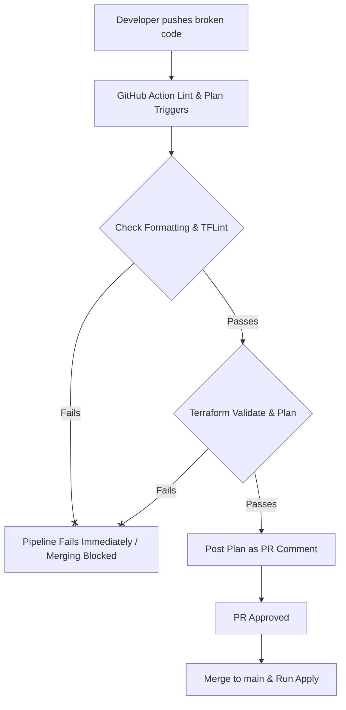

# Fast-Fail Terraform CI/CD Pipeline
[](https://www.terraform.io/)
[](https://github.com/features/actions)
[](https://en.wikipedia.org/wiki/DevOps)
[](LICENSE)

An automated, production-grade **Infrastructure as Code (IaC)** CI/CD pipeline demonstrating best-practice release engineering workflows. This project leverages **HashiCorp Terraform** and **GitHub Actions** to implement a robust **Fast-Fail** pipeline. 

By applying strict validation, linting, and dry-run planning stages to Pull Requests, the system guarantees that only syntactically perfect, security-compliant, and successfully planned infrastructure code is ever merged into the main release branch.

---

## 1. Project Description

This project serves as a showcase for modern Automated Release Engineering. Rather than targeting complex cloud platforms that incur running costs, it utilizes the **Terraform Local Provider** to manage local file structures as mock resources. This allows for rapid iteration and demonstrates the core CI/CD pipeline mechanics in a highly accessible and cost-efficient manner.

The pipeline is split into three core phases:
1. **Lint & Verify (PR Phase 1):** Validates style guidelines (`terraform fmt`), syntax structures (`terraform validate`), and static code analysis standards (`tflint`).
2. **Plan & Report (PR Phase 2):** Generates a dry-run execution plan and posts the output directly to the Pull Request as a developer-friendly comment, facilitating peer review.
3. **Apply & Deploy (Merge Phase):** Runs automatically upon merging to `main`, securely initializing, planning, and executing the actual changes to target infrastructure.

---

## 2. Architecture Diagram

```text
                                      PULL REQUEST (Target: main)
                                  ┌────────────────────────────────┐
                                  │                                │
  ┌─────────────────┐             ▼      1. LINT WORKFLOW          │
  │  Feature Branch │ ───────────► ┌─────────────────────────────┐ │
  └─────────────────┘              │  • terraform fmt -check     │ │
           ▲                       │  • terraform validate       │ │
           │                       │  • tflint                   │ │
      Local Git                    └──────────────┬──────────────┘ │
       Changes                                    │ Pass           │
                                                  ▼                │
                                         2. PLAN WORKFLOW          │
                                   ┌─────────────────────────────┐ │
                                   │  • terraform init           │ │
                                   │  • terraform plan           │ │
                                   │  • Post PR comment via API  │ │
                                   └──────────────┬──────────────┘ │
                                                  │                │
                                                  ▼                │
                                        Code Review & Approval     │
                                  │                                │
                                  └───────────────┬────────────────┘
                                                  │ Merge to main
                                                  ▼
                                         3. APPLY WORKFLOW
                                   ┌─────────────────────────────┐
                                   │  • terraform init           │
                                   │  • terraform plan -out      │
                                   │  • terraform apply (approve)│
                                   └─────────────────────────────┘
```

---

## 3. Features

*   **Fast-Fail CI Loop:** Instantly halts pull requests that do not adhere to formatting guidelines, fail syntax validation, or trigger TFLint rules.
*   **Automated PR Feedbacks:** Dynamically comments the output of the dry-run `terraform plan` on the PR using `actions/github-script`, saving developers from navigating through raw build logs.
*   **Infrastructure State Safety:** Restricts target applications (`terraform apply`) exclusively to the `main` branch post-merge, ensuring the state aligns with code reviews.
*   **Static Code Analysis:** Integrates `tflint` to catch provider-specific errors and enforce infrastructure design patterns.
*   **Execution Isolation:** Fully modular workflows separated into distinct GitHub Actions yaml definitions (`lint.yml`, `plan.yml`, `apply.yml`).

---

## 4. Technology Stack

*   **Infrastructure as Code:** HashiCorp Terraform `v1.15.5`
*   **CI/CD Orchestration:** GitHub Actions
*   **Static Analysis & Linting:** `TFLint v4` & Built-in Terraform CLI linters
*   **API Interactivity:** GitHub Script (Node.js SDK wrapper for GitHub REST APIs)
*   **Infrastructure Provider:** HashiCorp `local` Provider (`v2.5.x`)

---

## 5. Repository Structure

```text
.
├── .github/
│   └── workflows/
│       ├── lint.yml         # Formats, validates syntax, runs tflint (PR trigger)
│       ├── plan.yml         # Performs terraform plan & posts comment (PR trigger)
│       └── apply.yml        # Executes terraform apply on push to main (Merge trigger)
├── .gitignore               # Excludes state files, plan files, and caches
├── main.tf                  # Local provider resource declarations
├── provider.tf              # Terraform engine and provider configurations
└── README.md                # Project documentation
```

---

## 6. Prerequisites

Before running this project locally or setting it up in your repository, ensure you have:
1.  **Git** installed.
2.  **Terraform CLI** (v1.0.0+) installed locally.
3.  **TFLint** installed locally.
4.  **GitHub CLI (gh)** (optional, but recommended for simulating PR creation).

---

## 7. Installation and Setup

### Local Run-through
1. **Clone the Repository:**
   ```bash
   git clone <your-repository-url>
   cd fast-fail-mini-project
   ```

2. **Initialize Provider Plugins:**
   ```bash
   terraform init
   ```

3. **Verify Configuration:**
   ```bash
   terraform validate
   ```

4. **Run Dry Run locally:**
   ```bash
   terraform plan
   ```

### Simulating the CI/CD Pipeline
To test the fast-fail workflows exactly as a developer would:

1. **Create and Switch to a Feature Branch:**
   ```bash
   git checkout -b feature/demo-file-update
   ```

2. **Modify the Infrastructure:**
   Modify the content inside [main.tf](file:///d:/Sumit/CODE/LNT_DevOps/Day5/fast-fail_Mini-Project/main.tf). For example, change:
   ```hcl
   content  = "Staging Environment - Updated v2"
   ```

3. **Format and Commit Changes:**
   ```bash
   terraform fmt
   git add main.tf
   git commit -m "chore: update staging environment content"
   ```

4. **Push the Branch to GitHub:**
   ```bash
   git push origin feature/demo-file-update
   ```

5. **Create a Pull Request:**
   You can use the GitHub web interface or run the following command using the GitHub CLI:
   ```bash
   gh pr create --title "feat: update staging mock resource" --body "Testing Fast-Fail Terraform CI/CD workflows."
   ```

---

## 8. Terraform Configuration Explanation

### [provider.tf](file:///d:/Sumit/CODE/LNT_DevOps/Day5/fast-fail_Mini-Project/provider.tf)
Defines the required engine versions and specifies the HashiCorp `local` provider registry source and version constraint `~> 2.5`.
```hcl
terraform {
  required_version = ">= 1.0"

  required_providers {
    local = {
      source  = "hashicorp/local"
      version = "~> 2.5"
    }
  }
}

provider "local" {}
```

### [main.tf](file:///d:/Sumit/CODE/LNT_DevOps/Day5/fast-fail_Mini-Project/main.tf)
Defines two `local_file` resources simulating a production deployment target (e.g., configuring configuration parameters or web content):
```hcl
resource "local_file" "demo" {
  filename = "hello.txt"
  content  = "Hello from Terraform CI/CD Pipeline"
}

resource "local_file" "staging" {
  filename = "staging.txt"
  content  = "Staging Environment"
}
```

---

## 9. GitHub Actions Workflow Explanation

The repository is modularized into three workflows inside `.github/workflows/`:

### 1. Lint and Validate (`lint.yml`)
Triggers on any pull request targeting `main`. Its primary function is to fail early if code hygiene is substandard.
*   **Format Check:** `terraform fmt -check -recursive` checks if code style conforms to standards without rewriting it.
*   **Syntax Check:** Runs `terraform init -backend=false` to download providers offline followed by `terraform validate` to check configuration validity.
*   **Static Code Analysis:** Installs and initializes `tflint` to detect potential design flaws, deprecated syntax, or bad practices.

### 2. Dry Run Plan & Report (`plan.yml`)
Triggers alongside `lint.yml` on pull requests.
*   **Plan Compilation:** Runs `terraform plan -no-color` and pipes output to a file (`plan-output.txt`).
*   **Workflow Safety:** Utilizes `continue-on-error: true` on the plan execution to capture failure logs.
*   **Comment Injection:** Employs `actions/github-script` to read the plan file and post it to the active pull request via REST APIs.
*   **Strict Fail Action:** Asserts the outcome of the plan step, forcefully returning code `1` if the plan failed, stopping the merge option safely.

### 3. Deploy Execution (`apply.yml`)
Triggers **only** on push actions directly targeting `main` (i.e. PR Merges).
*   **Plan Isolation:** Generates an execution plan artifact (`terraform plan -out=tfplan`).
*   **Safe Apply:** Runs `terraform apply -auto-approve tfplan` to guarantee the exactly reviewed plan is deployed without human intervention.

---

## 10. How Fast-Fail CI/CD Safeguards the Main Branch

In traditional deployment workflows, invalid code might bypass human code reviews because syntax errors are difficult to catch manually. The **Fast-Fail** mechanism prevents this by stopping the CI pipeline immediately if any of the checks fail, blocking the merge button.



### Key Guardrails:
1.  **Non-destructive failures:** If a syntax error is introduced, the `lint` job fails within ~30 seconds, preventing resources from executing.
2.  **No Blind Merges:** Peer reviewers do not have to guess what resources will change. The plan output is explicitly presented in the conversation thread. If planning fails, the status check turns red.

---

## 11. Debugging Case Study: Permissions & GITHUB_TOKEN API Limits

### The Problem
During development of the `plan.yml` workflow, the step `Post Plan as PR Comment` consistently crashed with the following error output:
```text
HttpError: Resource not accessible by integration (403)
  at /home/runner/work/_actions/actions/github-script/v7/dist/index.js:6880
```
This error occurred because GitHub Actions runs with a default `GITHUB_TOKEN` that is read-only in modern security policies. The script attempting to call `github.rest.issues.createComment` did not have write authority to post comments on Pull Requests.

### The Resolution
We added a granular `permissions` block within [plan.yml](file:///.github/workflows/plan.yml) to explicitly grant the runner the permission to write to pull requests while keeping standard contents read-only.

```yaml
permissions:
  contents: read
  pull-requests: write
```

This resolved the `403 Forbidden` errors, verifying the Least Privilege model and ensuring secure, automated PR commenting.

---

## 12. Examples

### Validation Failure Example
If a developer enters an undeclared resource attribute or variable name, the lint workflow fails immediately:
```text
Error: Unsupported attribute

  on main.tf line 3, in resource "local_file" "demo":
   3:   invalid_attribute = "oops"

This object does not have an attribute named "invalid_attribute".
```
The status check blocks the pull request:


### Successful Pipeline Example
When configuration parameters are valid, a dynamic comment is published showing the proposed additions:
```markdown
### Terraform Plan
```
Terraform will perform the following actions:

  # local_file.demo will be created
  + resource "local_file" "demo" {
      + content              = "Hello from Terraform CI/CD Pipeline"
      + directory_permission = "0777"
      + file_permission      = "0777"
      + filename             = "hello.txt"
      + id                   = (known after apply)
    }

Plan: 1 to add, 0 to change, 0 to destroy.
```
```

---

## 13. Screenshots (Placeholders)

*To complete this portfolio presentation, replace these placeholders with images of your active workflows:*

1.  **PR Lint Failure Screen:**
    
2.  **Successful PR Plan Comment:**
    
3.  **Deployment Run (Apply):**
    

---

## 14. Key DevOps Concepts Demonstrated

*   **Infrastructure as Code (IaC):** Treating infrastructure declarations with the same rigor as application code (auditable, version-controlled, automated).
*   **Continuous Integration (CI) / Shift-Left:** Pulling security scans, code validation, and planning checks closer to the developer's commit timeline.
*   **Continuous Deployment (CD):** Transitioning code from revision checks to live environments without manual staging steps.
*   **GitOps / Pull Request Driven Development:** The pull request acts as the sole source of truth and deployment gatekeeper.

---

## 15. Learning Outcomes

By building and running this project, we acquired skills in:
*   Writing valid, formatted, and optimized HashiCorp Configuration Language (HCL).
*   Integrating third-party static checkers (`tflint`) in custom runners.
*   Manipulating the GitHub REST API programmatically using Octokit via `github-script`.
*   Structuring workflow files to separate test phases (Lint/Plan) from release actions (Apply).
*   Using localized providers to iterate rapidly on pipeline patterns.

---

## 16. Future Improvements

*   **Remote State Backend:** Upgrade state storage from local disk to S3/Azure Blob with DynamoDB state locking to enable multiple developers to run concurrently.
*   **Security Integration:** Add static security scanning using tools like `Checkov`, `tfsec`, or `Trivy` in the CI pipeline.
*   **Multi-Environment Isolation:** Deploy variables and environments using workspaces or Terragrunt wrappers.

---

## 17. Author Information

*   **Name:** Sumit
*   **GitHub:** [@Sumit](https://github.com/) *(Update with your GitHub handle)*
*   **LinkedIn:** [Your LinkedIn Profile](https://linkedin.com/)

---

## 18. License

This project is licensed under the MIT License - see the [LICENSE](LICENSE) file for details.

---

## 19. Acknowledgements

*   Built as part of an Automated Release Engineering DevOps curriculum.
*   Special thanks to the open-source maintainers of Terraform and GitHub Actions.
